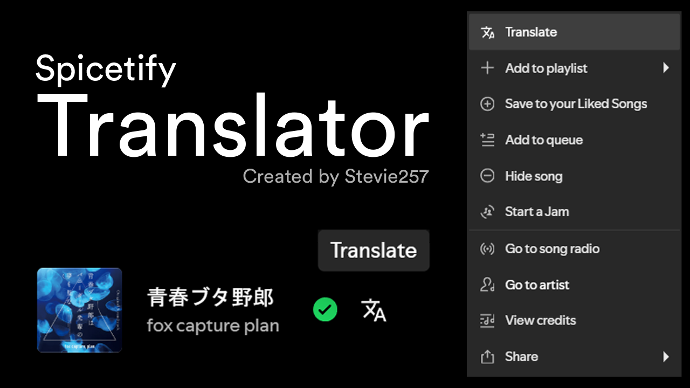
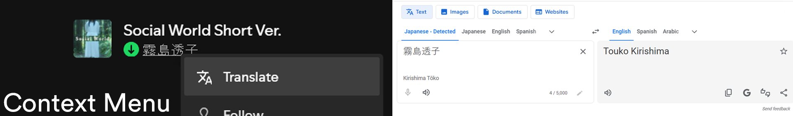
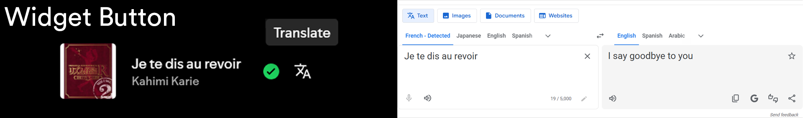

# Spicetify Translator
Adds a button to translate stuff in Spotify (tracks, albums, playlists, artists, etc.)

Clicking the translate button opens Google Translate in your browser with the text you want to translate





---

## Installation

The extension can be found on the marketplace or installed manually

### Manual Installation

Download `translator.js`

Add the file to your Extensions folder and run
```
spicetify config extensions translator.js
spicetify apply
```
